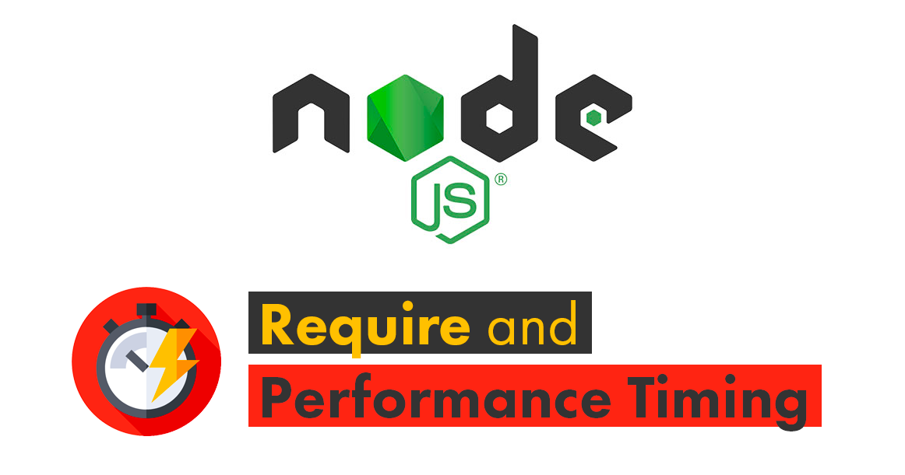

<p align="center">
  
</p>

<h1 align="center">Tutorial Nodejs Performance Timing</h1>

<p align="center">With this tutorial you can create a NodeJS Application CLI which calculates how long the 'require' function takes for each module.</p>

<p align="center">
  <a title="MIT License" href="LICENSE.md">
    
  </a>
  <a title="Twitter: JoseJ_PR" href="https://twitter.com/JoseJ_PR">
    
  </a>  
  <a title="Github: Sponsors" href="https://github.com/sponsors/JoseJPR">
    
  </a>
  <br />
  <br />
</p>

## 🔖 Description

The **⏳Startup Time** for an HTTP Server or CLI Apps is super important. The time it takes for the Nodejs application to be up and running will also depends on the time it takes to import the modules that the application requires.

The Performance Timing API provides an implementation of the W3C Performance Timeline specification. The purpose of the API is to support the collection of high resolution performance metrics.

Official Documentation: [NodeJS | Performance Timing API](https://nodejs.org/api/perf_hooks.html)

## 📹 Video Demo

The following video shows how you can get the time that the require function need for each module.

[](https://youtu.be/6J2knxcVSuY)

## ⛅️ Develop in the Cloud

You can run this project in Gitpod, a one-click online IDE for GitHub:

[](https://gitpod.io/#https://github.com/JoseJPR/tutorial-nodejs-performance-timing)

## 📌 Methodologies and Guidelines

List of methodologies and tools used in this project for compliance with Quality Assurance Code (QAC)

* ESTlint, tool for identifying and reporting on patterns found in ECMAScript/JavaScript code. \
  [NPM ESLint](https://www.npmjs.com/package/eslint) \
  [NPM ESLint | Airbnb](https://www.npmjs.com/package/eslint-config-airbnb)

## ✅ Prerequisites

In order to work with this project, your local environment must have at least the following versions:

* NodeJS Version: 13.xx
* NPM Version: 6.12.0

## 📐 How to work with this project

You have to do the following steps to be able to work with this project.

### 1️⃣ Install Nodejs Dependencies

To work with this project locally it is necessary to install the NPM dependencies.

```bash
# Install npm dependencies
$npm i
```

### 2️⃣ Run

```bash
# Run Application
$npm run start
```

## 📂 Code scaffolding

```any
/
├── assets 🌈               # Images Sources.
├── src 📦                  # Main App with forks process.
|   ├── subprocess          # Process to launch by "fork" and calculate times..
|   └── ...
└── ...
```

## ⛽️ Review and Update Sependencies

For review and update all npm dependencies of this project you need install in global npm package "npm-check-updates" npm module.

```bash
# Install and Run
$npm i -g npm-check-updates
$ncu
```

## License

[MIT](LICENSE.md)

## Happy Code

Created with JavaScript, lot of ❤️ and a few ☕️

## This README.md file has been written keeping in mind

[GitHub Markdown](https://guides.github.com/features/mastering-markdown/) \
[Emoji Cheat Sheet](https://www.webfx.com/tools/emoji-cheat-sheet/)
